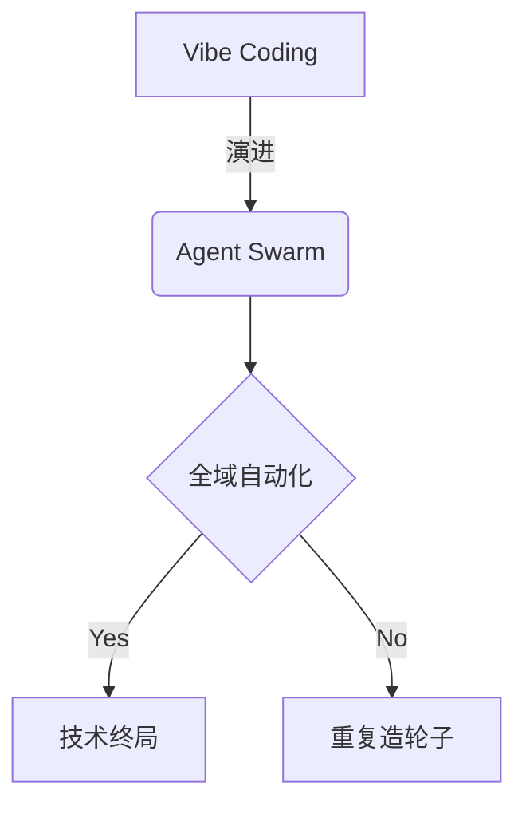

# 欢迎来到 AI 原生工程的世界

这是一本由极客发起、AI 深度参与编写的开源技术专著。
本页已调整为“目录与样式联调样本”，用于后续 TOC、标题层级、meta 信息样式的快速验证。

## 页面 Meta（用于样式联调）

### 当前 Frontmatter

- `title`: 前言
- `description`: AI 原生工程：Vibe Coding 进阶与全域自动化落地
- `icon`: BookOpen
- `full`: false

### 设计意图

#### 为什么保留 `full: false`

用于验证标准文档容器宽度下，TOC 与正文在复杂标题结构中的视觉稳定性。

#### 为什么新增 `icon`

用于验证侧边栏导航项中的图标占位、行高对齐以及深浅色切换对比度。

## 目录索引

- **[第一篇：破局](/docs/level-1)**：编程范式的第三次跨越
- **[第二篇：暗礁](/docs/level-2)**：真实场景的痛点与防线
- **[第三篇：实战](/docs/level-3)**：落地全栈 AI 工作流
- **[第四篇：越界](/docs/level-4)**：赋予 AI “手”与“眼”
- **[第五篇：终局](/docs/level-5)**：拥抱 Agent Swarm 与反脆弱设计

:::note
本书的内容正在持续构建中，部分章节可能会经历频繁的重构。欢迎通过 [GitHub](https://github.com/TatsukiMeng/ai-native-engineering) 参与共创！
:::

## 标题层级压测区（TOC 样式重点）

### 第一层：个人开发者阶段

#### IDE 级协作

##### Prompt 复用与上下文边界

围绕 Prompt 模板化、上下文窗口复位、任务拆分粒度，验证 `h2/h3/h4/h5` 的层级缩进与 active 高亮表现。

##### Debug 驱动式协作

验证“长标题 + 英文术语”场景：Copilot Agent + Terminal + MCP 的串联排版效果。

#### 数据与后端阶段

##### PostgreSQL 与迁移策略

关注数据库章节在目录中的可扫描性：标题密度高时是否仍能快速定位。

##### API 可靠性与熔断策略

关注告警色、链接色、代码内联色在深浅色主题下的一致性。

### 第二层：团队工程化阶段

#### 前端跨端与边界拆分

##### Web / Tauri / Wujie 复用策略

用于验证目录中“斜杠、短横线、括号”类标题文本的换行策略。

##### 组件协议与设计 Token

用于验证 TOC 宽度受限时的文本截断与 hover 展示效果。

#### 自动化流程与质量控制

##### CI 与静态导出约束

强调 `output: 'export'` 场景下的构建约束和产物一致性。

##### 回归验证与基线对比

强调“只改样式，不改语义”的迭代流程。

### 第三层：架构师与 Swarm 阶段

#### Agent Swarm 协作模型

##### 全域任务编排

关注章节目录在“概念层级深、跨度大”时的可读性。

##### Token 成本治理

关注“高频章节更新”下目录 active 状态跳转稳定性。

#### 风险与治理

##### 合规、审计与回溯

用于验证目录项较多时滚动条/遮罩（mask）观感。

##### 故障演练与降级路径

用于验证移动端折叠目录中的层级可点击面积。

## 🚀 集成的 MDX 高级特性

### 提示框组件（Callouts / Admonitions）

通过 `remark-directive` 与 `fumadocs-core/mdx-plugins` 支持，你可以在 Markdown 中直接使用 `:::` 语法。

**基础类型展示：**

:::note
这是一条普通的注意信息 (Note)。通常用于补充说明环境配置、版本要求等日常提醒。
:::

:::tip
这是一条建议提示 (Tip)。可以用来向读者推荐最佳实践、快捷键或者更优雅的实现方式。
:::

:::info
这是一条信息提示 (Info)。和 Note 类似，但侧重于提供一般性的背景知识。
:::

:::warning
这是一条警告信息 (Warning)。用于提醒读者某些操作存在风险，比如可能导致性能下降或者引发连带问题。
:::

:::danger
这是一条高危警告 (Danger)。用于极度危险的操作，例如不可逆的数据删除、导致系统崩溃的配置。
:::

### 自定义标题与内容嵌套

你可以在类型名称后面直接跟随自定义文本作为标题，内部甚至还可以包裹代码块或列表：

:::warning[这是一个包含自定义标题的警告]
如果在进行大重构之前没有提交当前 `git commit`，你可能会**丢失所有代码**。以下是建议的工作流：
1. 检查 `git status`
2. 运行所有的单元测试
```bash
bun run test
```
:::

:::tip[高级用法：嵌套提示框]
在写作中，有时候我们需要在提示框中进一步强化某个痛点：
> 别忘了，AI 生成的代码偶尔也会存在上下文遗忘的情况。
:::

### Mermaid 图表渲染

我们通过 `remarkMdxMermaid` 实现了原生 Mermaid 语法的构建期预编译支持，你可以直接书写标准的 Mermaid 代码块。



### Git 元信息注入

通过 `lastModified()` 插件，我们在页面底部（评论区上方）实现了基于最近一条 Git 提交记录生成的页面「最后更新时间」。当你修改本页面并推送到主分支，时间会自动更新。

### Giscus 评论系统

我们引入了 `@giscus/react` 并支持了自动适配当前系统的亮、暗色模式，它会自动抓取当前路由页面名称并关联到 GitHub Discussions 对应的主题下。
