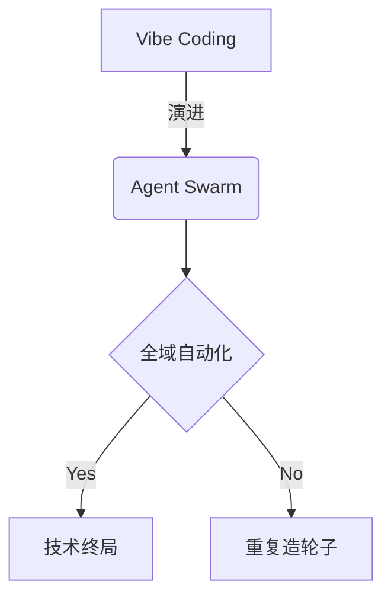

# 欢迎来到 AI 原生工程的世界

这是一本由极客发起、AI 深度参与编写的开源技术专著。

本书力图为你展现一幅从“日常工具提效”到“全域智能调度”的演进图谱。

## 目录索引

- **[第一篇：破局](/docs/level-1)**：编程范式的第三次跨越
- **[第二篇：暗礁](/docs/level-2)**：真实场景的痛点与防线
- **[第三篇：实战](/docs/level-3)**：落地全栈 AI 工作流
- **[第四篇：越界](/docs/level-4)**：赋予 AI “手”与“眼”
- **[第五篇：终局](/docs/level-5)**：拥抱 Agent Swarm 与反脆弱设计

:::note
本书的内容正在持续构建中，部分章节可能会经历频繁的重构。欢迎通过 [GitHub](https://github.com/TatsukiMeng/ai-native-engineering) 参与共创！
:::

## 🚀 集成的 MDX 高级特性

我们在本工程中集成了一系列强大的 MDX 与编译期组件，以下为效果预览与使用规范（方便后续主题定制与样式调试）：

### 1. 提示框组件 (Callouts / Admonitions)
通过 `remark-directive` 与 `fumadocs-core/mdx-plugins` 支持，你可以在 Markdown 中直接使用 `:::` 语法。这涵盖了基础类型、自定义标题，以及嵌套复杂内容。

**基础类型展示：**

:::note
这是一条普通的注意信息 (Note)。通常用于补充说明环境配置、版本要求等日常提醒。
:::

:::tip
这是一条建议提示 (Tip)。可以用来向读者推荐最佳实践、快捷键或者更优雅的实现方式。
:::

:::info
这是一条信息提示 (Info)。和 Note 类似，但侧重于提供一般性的背景知识。
:::

:::warning
这是一条警告信息 (Warning)。用于提醒读者某些操作存在风险，比如可能导致性能下降或者引发连带问题。
:::

:::danger
这是一条高危警告 (Danger)。用于极度危险的操作，例如不可逆的数据删除、导致系统崩溃的配置。
:::

**自定义标题与内容嵌套：**

你可以在类型名称后面直接跟随自定义文本作为标题，内部甚至还可以包裹代码块或列表：

:::warning[这是一个包含自定义标题的警告]
如果在进行大重构之前没有提交当前 `git commit`，你可能会**丢失所有代码**。以下是建议的工作流：
1. 检查 `git status`
2. 运行所有的单元测试
```bash
bun run test
```
:::

:::tip[高级用法：嵌套提示框]
在写作中，有时候我们需要在提示框中进一步强化某个痛点：
> 别忘了，AI 生成的代码偶尔也会存在上下文遗忘的情况。
:::

### 2. Mermaid 图表渲染
我们通过 `remarkMdxMermaid` 实现了原生 Mermaid 语法的构建期预编译支持，你可以直接书写标准的 Mermaid 代码块。



### 3. Git 元信息注入
通过 `lastModified()` 插件，我们在页面底部（评论区上方）实现了基于最近一条 Git 提交记录生成的页面「最后更新时间」。当你修改本页面并推送到主分支，时间会自动更新。

### 4. Giscus 评论系统
我们引入了 `@giscus/react` 并支持了自动适配当前系统的亮、暗色模式，它会自动抓取当前路由页面名称并关联到 GitHub Discussions 对应的主题下。
